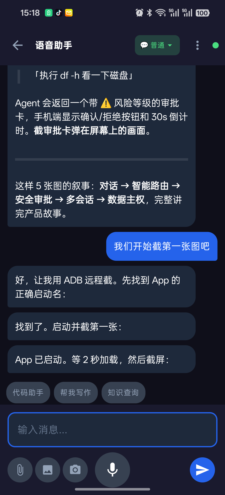
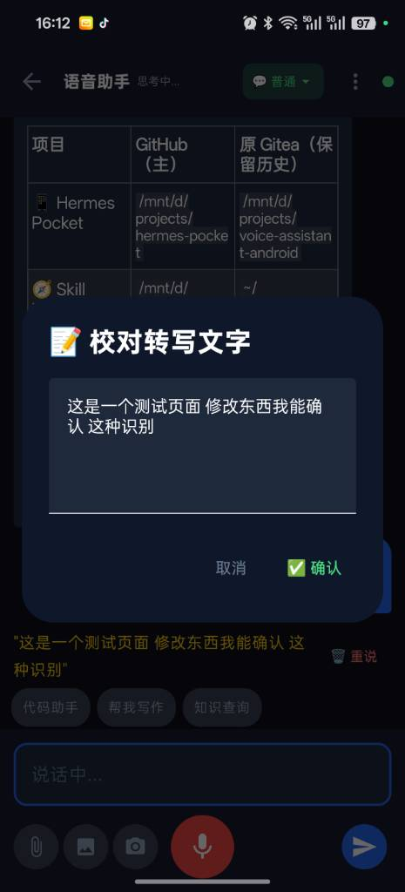
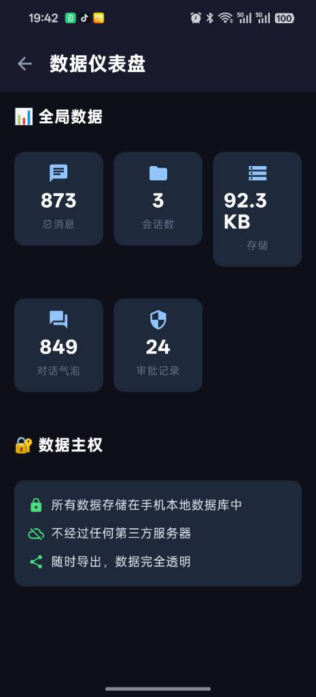

# Hermes Pocket · YouShu (有数) — Your Data, Your Sage

> **Hermes Pocket** — The Android pocket client for Hermes Agent. **YouShu / Tomo — "Know your numbers, own your hand."**

[](LICENSE)
[](https://developer.android.com)
[](https://kotlinlang.org)
[](https://github.com/NousResearch/hermes-agent)

**Hermes Pocket** is the local-first Android client for [Hermes Agent](https://github.com/NousResearch/hermes-agent) — Hermes in your pocket. The app is called **YouShu (有数)** and can be adapted to any compatible Agent backend.

Unlike QQ/WeChat/Telegram platform gateways, Hermes Pocket keeps everything on your phone — conversations, voice recordings, AI-generated files, images. All yours. View, search, export, or delete at any time.

## Screenshots

||||
|---|---|---|
|Main Chat|Chat (Dark Mode)|Dashboard|

## Vision

The paradox of current AI assistants: the more you use them, the more data they collect — but that data trains **someone else's model**. You don't benefit.

**Hermes Pocket changes this: your data trains your model.**

```
Their AI                              Hermes Pocket
───────────                           ──────────────
Your data ─→ Their servers            Your data ─→ Stays on your phone
          ─→ Trains their models                  ─→ Proofread → Fine-tune
          ─→ You get nothing back                 ─→ Your model keeps improving
```

| Principle | Meaning |
|-----------|---------|
| **Privacy First** | Voice processed locally, conversations stored on-device, no third-party access |
| **Data as Asset** | Every interaction builds your training dataset — your own corpus, growing daily |
| **Self-Evolving** | ASR model improves with more usage via fine-tuning; Agent memory gets richer over time |
| **User Control** | View, search, export, delete your data anytime. One-tap full backup |
| **End-to-End Direct** | Phone connects to Hermes via frp tunnel — no platform servers in between |
| **Offline Capable** | Core features (ASR) work without internet |

## Product Highlights

| Feature | Description |
|---------|-------------|
| 🏠 **Data Sovereignty** | Conversations, voice, files — all on your phone. You own your data. View, search, export, delete anytime. |
| 🧭 **Intent Routing** | You say "help me write", not "load powerpoint skill". User intent → Skill Manager mapping → Hermes skill. Two-layer translation keeps technical details invisible. Same capability supports multiple output formats — pick a format, auto-routed to the right skill. |
| 🧬 **Self-Evolving** | Every recording accumulates training data. ASR model fine-tunes with usage; the more you speak, the more it understands you. |
| 📱 **Phone-Native** | Not a web wrapper. GPS, calendar, alarm, contacts, SMS — 16 phone tools deeply integrated. The Agent reads your location, checks your schedule, sends SMS on your behalf. |
| 🔗 **Agent-Agnostic** | First adapted for Hermes Agent, but architecture is backend-decoupled — swap adapters for other Agent frameworks. |
| 🎯 **Zero Platform Lock-In** | frp tunnel directly to your own server. No third-party platforms. No vendor lock-in. No data harvesting. |

## Architecture

```
Phone App (YouShu) ╌╌ frp ╌╌ Hermes Gateway (8643/8644) ╌╌ Skill Manager (8888)
─────────────              ───────────────────────        ──────────────────
Jetpack Compose     ←WS→   mybot Adapter (cap→skill) ←HTTP→ Flask REST API
Room SQLite                 WebSocket Server               SQLite DB
sherpa-onnx ASR             + /v1/capabilities proxy       capabilities.db
                            + /v1/formats query            + format_routing
```

- **Phone ↔ Hermes**: Via frp public tunnel. Configurable in Settings (default `ws://your-server-ip:8643`)
- **Hermes ↔ Skill Manager**: Internal localhost:8888, never exposed publicly
- **Capability Routing**: Capability Chip → adapter queries Skill Manager mapping → auto-loads skills → clarifies format → routes to sub-skill
- **Details**: Settings page for all connection parameters

## Installation

### Option 1: Phone App (for end users)

1. **Download APK**  
   Download the latest `hermes-pocket.apk` from [Baidu Cloud](https://pan.baidu.com) (link coming soon)

2. **Install**  
   Transfer the APK to your phone and tap to install (allow "Unknown sources" if prompted)

3. **Configure server**  
   Open App → Settings → enter your Hermes server address:
   - WebSocket: `ws://your-server-ip:8643`
   - HTTP: `http://your-server-ip:8643`

4. **Start using**  
   Return to chat — a green dot means you're connected. Speak or type to start.

> 💡 You can also build from source: `git clone` this repo → open in Android Studio → Build APK

### Option 2: Self-host Hermes Server (for developers)

#### 1. Install Hermes Agent

```bash
# One-liner install
curl -fsSL https://raw.githubusercontent.com/NousResearch/hermes-agent/main/scripts/install.sh | bash

# Configure model and API key
hermes setup
```

#### 2. Install mybot plugin (WebSocket server — required for phone connection)

```bash
# Copy plugin to Hermes plugins directory
cp -r hermes-plugin/mybot ~/.hermes/plugins/

# Set environment variable
echo "MYBOT_ALLOW_ALL_USERS=true" >> ~/.hermes/.env

# Enable the plugin
hermes plugins enable mybot

# Restart Gateway
hermes gateway restart
```

#### 3. (Optional) Install Skill Manager

```bash
git clone https://github.com/netment/skill-manager.git ~/skill-manager
cd ~/skill-manager
pip install -r requirements.txt
python server.py &   # Run in background, default port 8888
```

#### 4. Set up frp tunnel

Connect your phone to Hermes from anywhere:

```bash
# Server-side frps.ini
[common]
bind_port = 7000

# Client-side frpc.ini
[hermes-pocket]
type = tcp
local_ip = 127.0.0.1
local_port = 8643
remote_port = 8643
```

> 📖 Full frp setup: [frp docs](https://github.com/fatedier/frp)

## Capability Routing: User Perspective → Technical Skills

The core design that sets Hermes Pocket apart from typical chat clients: **your intent doesn't map directly to a single skill — it goes through two layers**.

```
User says "help me write"    Hermes loads corresponding skill
      │                              ▲
      ▼                              │
┌──────────────┐          ┌─────────────────┐
│  User View    │  mapping │  Technical View  │
│  Capability   │ ──────→ │  SKILL.md        │
│  Chip         │          │  (Hermes Skill)  │
└──────────────┘          └─────────────────┘
      │                              ▲
      │  Skill Manager               │
      │  capability_skills table      │
      └──────────────────────────────┘
```

### Why this layer?

| Problem | Direct Mapping | Hermes Pocket's Approach |
|---------|---------------|--------------------------|
| Users don't know skill names | Pick `powerpoint` chip | Pick "Help me write" — no technical jargon |
| One capability, many formats | Remember 4 different skills | Pick "Help me write" → clarify format → auto-route |
| Adding new formats | Change app code + add skill | One Skill Manager PUT API call |
| Multiple Agent backends | Change chip list per backend | Swap Skill Manager database |

### Real Example: "Help me write"

```
User View                                    Hermes Technical View
─────────                                   ──────────────────────
                                           ┌─ PowerPoint → hermes:powerpoint
help me write ─→ Skill Manager ─→ clarify ─┼─ PDF       → hermes:claude-design
                capability_skills   format   ─┼─ Word      → hermes:claude-design
                writing-assistant           ─└─ Markdown  → hermes:baoyu-infographic
```

- **Skill Manager database** manages `capability_skills` (capability → orchestrator skill) and `capability_format_skills` (capability → format → sub-skill)
- **Phone side** only shows user-friendly chip names; all decisions happen server-side
- **Extend formats** without touching the app: `PUT /v1/capabilities/help-me-write/formats` adds a row

### Current Capability Map

| User Sees | Capability ID | Orchestrator Skill | Supported Formats |
|-----------|--------------|-------------------|-------------------|
| 💬 General Assistant | `chat` | *(direct conversation, no skill)* | — |
| ✍️ Help me write | `writing` | `writing-assistant` | PowerPoint / PDF / Word / Markdown |
| 💻 Code Assistant | `coding` | `codex` + `claude-code` | — |
| 📚 Knowledge Search | `research` | `web_search` + `arxiv` | — |
| 🛠️ Phone Tools | `phone-tools` | *(16 built-in phone tools)* | GPS / Battery / Calendar / Alarm etc. |

> 💡 **Design philosophy**: Users care about "what I want to do", not "which skill to use". Skill Manager is the translation layer from user language to technical language.

## Roadmap

### ✅ Done

- 🎤 Offline speech recognition (sherpa-onnx SenseVoice + Silero VAD)
- 💬 Real-time WebSocket communication + auto-reconnect
- 📝 AI reply Markdown rendering (tables, code blocks, links)
- 🔊 Android TTS read-aloud (CosyVoice2 cloud synthesis, toggle in Settings)
- 🔐 **Dangerous command approval** — risk-level indicators + 30s auto-reject timeout + high-risk confirmation dialog
- ❓ **Clarify interaction cards** — tappable options, green highlight on selection
- 🛠️ **Tool progress cards** — inline execution progress with spin animation
- 📄 **File preview cards** — file type icon + size + one-tap download
- ⚠️ **Error notifications** — error messages in standalone bubbles
- 📋 **Step cards** — multi-step task progress `✅ ○ ⏳ ❌`
- 💡 **Suggestion cards** — collapsible hints with "adopt suggestion"
- 📎 File attachment push and download
- 💾 Multi-session management (Room DB persistence + Profile isolation)
- ⚙️ Dual Profile switching (Work / Home, both via frp)
- 📱 Jetpack Compose Material3 modern UI
- 🧭 **WeChat-style session list** — active/archive zones, preview text + timestamp
- 🎛️ **Compact top bar** — minimalist, session name + mode label, no keyboard obstruction
- 🔧 **Skill Chips** — Skill Manager-driven, horizontal scroll bar in chat for quick capability selection

### ✅ P0 — Data Foundation

- [x] 🔍 **Full-text search** — across all conversations + file contents
- [x] 📊 **Data dashboard** — local storage usage, message count, file statistics
- [x] 🗄️ **Session export/import** — JSON format, export and re-import
- [x] 🗄️ **Full backup/restore** — export all data to .sagebackup file
- [x] 🗄️ **Batch management** — clear messages, rename sessions

### ✅ P1 — Complete Experience

- [x] 🔔 **Local push notifications** — WorkManager polls Hermes every 15 min
- [x] 📎 **File upload** — send files/images from phone to Agent
- [x] 📷 **Camera input** — take a photo, send to Agent (stored locally)
- [x] ✍️ **Session management** — rename, pin, archive
- [x] 🔗 **System share integration** — "Share to YouShu" from any app
- [x] 🌐 **frp remote tunnel** — public server forwarding, connect anytime anywhere
- [x] ⚡ **Message send status** — sending/sent/failed, retry on failure
- [x] 💬📚🧠 **Assistant modes** — switch directly from top bar dropdown
- [x] 🔧 **Capability management** — toggle user capabilities in Settings, quick-switch chips in chat

### ✅ P2 — Phone-Native Capabilities

- [x] 📋 **Clipboard awareness** — external copy offers "fill input"
- [x] 🖼️ **Rich media inline** — images displayed inline in chat
- [x] 🎨 **Diagram rendering** — Mermaid flowcharts, architecture diagrams
- [x] 📝 **Message copy** — long-press bubble fills input field
- [x] 🎙️ **Record-to-send** — tap send during recording auto-stops + sends; fix errors before sending
- [x] 🟢 **Connection status simplified** — green dot = connected, only shows label on anomalies
- [x] 🔀 **Capability routing** — Chip select → Adapter auto-loads skill → Skill Manager format routing → clarify format

### 🚧 P3 — Advanced

- [x] 🛠️ **Phone tool registration** — 16 tools: GPS, battery, calendar, alarm, contacts, SMS, etc.
- [ ] 🤖 **Offline fallback model** — local quantized model when offline
- [ ] 🫧 **Chat head / Widget** — interact without opening the app
- [ ] 🏠 **Home screen widget** — one-tap quick entry
- [ ] 🌓 **Theme switching** — dark / light
- [ ] ✋ **Gesture control** — shake to wake / double-tap power button
- [ ] 🎙️ **Full-duplex voice** — real-time interrupt/overlap
- [ ] 🔥 **Wake word** — local KWS, fully offline
- [ ] 🧪 **ASR training pipeline** — proofread → fine-tune → export, continuous ASR improvement. Standalone project: asr-trainer (proofreader.py ✅ / finetune.py 🚧 / export_onnx.py 🚧)

## Acknowledgments — Building Blocks

Hermes Pocket stands on the shoulders of these open-source projects:

| Project | Description | Link |
|---------|-------------|------|
| **Hermes Agent** | AI Agent framework: tool calling, approval, multi-platform gateway | [hermes-agent.nousresearch.com](https://github.com/NousResearch/hermes-agent) |
| **sherpa-onnx** | On-device speech recognition inference engine, offline ASR | [github.com/k2-fsa/sherpa-onnx](https://github.com/k2-fsa/sherpa-onnx) |
| **FunASR** | Industrial-grade speech recognition toolkit, model training & proofreading | [github.com/modelscope/FunASR](https://github.com/modelscope/FunASR) |
| **CosyVoice** | Alibaba Tongyi speech synthesis, Chinese TTS | [github.com/FunAudioLLM/CosyVoice](https://github.com/FunAudioLLM/CosyVoice) |
| **frp** | NAT traversal, phone connects to Hermes anytime | [github.com/fatedier/frp](https://github.com/fatedier/frp) |
| **Skill Manager** | Capability → skill mapping service, format routing engine | [github.com/netment/skill-manager](https://github.com/netment/skill-manager) |
| **asr-trainer** | ASR training pipeline: proofread → fine-tune → export → deploy | [github.com/netment/asr-trainer](https://github.com/netment/asr-trainer) |
| **SenseVoice** | Multilingual speech recognition model (ZH/EN/JA/KO/Yue + emotion) | [github.com/FunAudioLLM/SenseVoice](https://github.com/FunAudioLLM/SenseVoice) |

---

📖 中文文档：[README.md](README.md)
📖 Technical docs：[DEVELOPMENT.md](DEVELOPMENT.md) — architecture, tech stack, build guide, project structure.
